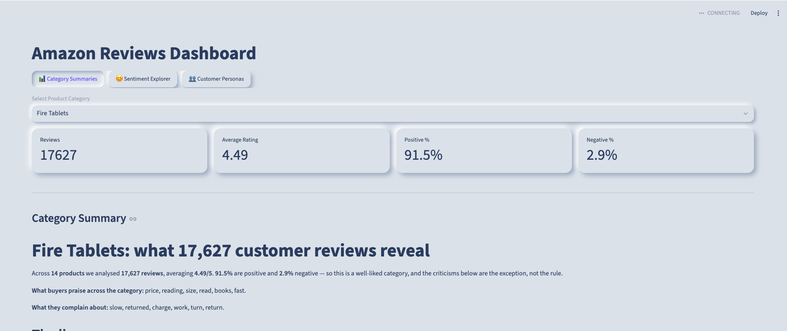

# 🛒 Amazon Reviews Dashboard

An NLP dashboard that turns 34,624 Amazon product reviews into insights for a
marketing team: what customers praise, what they complain about, and which
products suit which kind of buyer.

**🔗 Live app:** https://reviews-dashboard-ironhackaiproject.streamlit.app

**➡️ [IRONHACK-AI-PROJECT3](https://github.com/Martigol2/IRONHACK-AI-PROJECT3)**

## ✨ What it does

Three tabs, one per NLP component of the project:

- **📊 Category Summaries** — pick one of four product categories and read a
  data-grounded write-up: rating, sentiment split, what buyers praise and
  complain about, per-product breakdowns and real quotes.
- **😊 Sentiment Explorer** — paste any review; a trained classifier predicts
  Positive / Neutral / Negative and shows which words drove the decision.
- **👥 Customer Personas** — pick a buyer type (book lover, parent, movie
  watcher…) and get the best-matching product, the themes it matched on, and
  real customer reviews you can hover to read in full.

## ⚙️ How it works

The heavy NLP runs **offline in notebooks**; the app only reads the results.
This keeps it fast, free to host, and — crucially — means no product figure in
the app can be wrong, because none of them are generated at request time.

| Component | Model | Runs in the app? |
|---|---|---|
| Sentiment classification | TF-IDF + Linear SVM (scikit-learn) | Yes — live prediction |
| Product clustering | K-Means over category text | Precomputed |
| Review summarization | FLAN-T5 + rule-based facts | Precomputed |

The one model that runs live is a 0.2 MB SVM. The app never loads a large
language model, so it fits comfortably on Streamlit's free tier.

## 🎨 Interface

A soft neumorphic UI built with Streamlit theming and custom CSS. Review
snippets appear as hover cards — hover any snippet to read the full review
without cluttering the page.

## 🚀 Run it locally

    git clone https://github.com/MArtigol2/reviews-dashboard.git
    cd reviews-dashboard
    pip install -r requirements.txt
    streamlit run app.py

## 📁 Data

The `data/` folder holds precomputed outputs from the analysis notebooks:

- `reviews_slim.parquet` — reviews with cluster labels and sentiment
- `evidence_pack.json` — per-category facts (rankings, themes, quotes)
- `articles.json` — the four generated category summaries
- `svm_pipeline.pkl` — the trained sentiment model

## 📓 The analysis behind it

The notebooks that produce everything this app reads — data cleaning, sentiment
classification, product clustering and review summarization — live in the source
project repo:

**➡️ [IRONHACK-AI-PROJECT3](https://github.com/Martigol2/IRONHACK-AI-PROJECT3)**

## 🧰 Tech stack

Streamlit · pandas · scikit-learn — deployed on Streamlit Community Cloud.

## ⚠️ Limitations

- The catalogue is 38 Amazon devices; the app describes this dataset, not
  products in general.
- Reviews are ~97% positive, so "worst product" often means "lowest rated,"
  not "bad" — the app labels this honestly.

## 👥 Team

Built by Casilda Gil de Santivanes Finat ([casildagsf](https://github.com/casildagsf))
and Felipe Martignon ([MArtigol2](https://github.com/MArtigol2)) for the
Ironhack AI Engineering bootcamp.